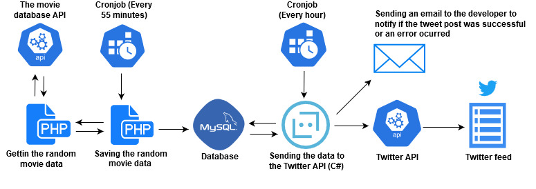

# TwitterBot: tweets random movies
### What is this? Why?
This is a personal project by Jhzeg(me) with the intentation of learning and practicing C# and at the same
time learn something about software design and systems architecture.
### Project status
**This project is in DEVELOPMENT**
### Abstract
This project aims to recommend random movies to people on Twitter
### Goal/Objectives
Create a fully automated bot who can tweet a random movie every hour
### Stakeholders
Owner: Jhzeg(me)
Users: Any user on Twitter
### Assumptions
- The random movie data will be updated every 55 minutes of every hour.
- The Twitter Bot will fetch for the movie data stored in the database every 59 minutes of every hour.
### Limitations and Uknows 
- Just one tweet per hour.
- Max of 280 characters per tweet.
- Somethimes the movie overview is not avaible.
### Uses cases
- People who follows the bot on twitter will get a random movie recommendation each hour.
- Each time the bot tweets it will send a email to the developer notifying if the tweet was successful or an error ocurred.
### Out of scope
- The bot cannot response messages.
- The bot cannot tweet any other data.
### Diagram

